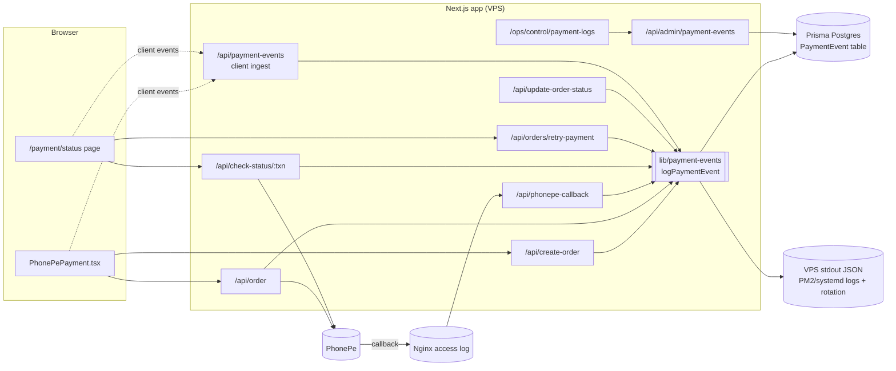
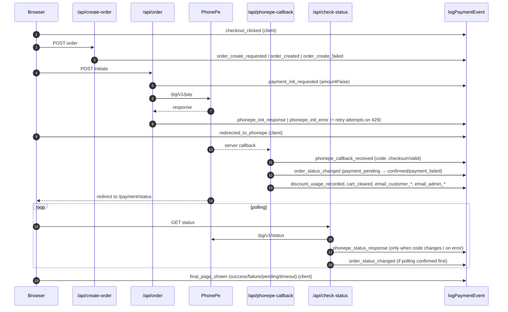

# Payment Event Logging — System Design

Status: **Proposed**, not yet implemented. The API and database contracts are in [API_AND_DB_DESIGN.md](./API_AND_DB_DESIGN.md). The current payment flow is described in [../PHONEPE_INTEGRATION.md](../PHONEPE_INTEGRATION.md).

## 1. Goal

Keep a durable, queryable timeline of every payment attempt, from the moment the customer clicks **Pay** until the order ends up confirmed, failed, pending or abandoned. This includes **every response received from PhonePe**. It should answer questions like:

- "Money was deducted but my order shows pending."
- "PhonePe says success, but we have no confirmation email."
- "Which path confirmed this order: the callback or status polling?"
- "Did PhonePe's callback ever reach our server?"

Non-goals:

- Replacing the `Order` record as the source of truth for payment state.
- General application logging.
- Analytics.

## 2. Deployment context

| Component | Current setup |
| --- | --- |
| App | Single Next.js 15 app on a Hostinger VPS, run by a process manager (PM2 or systemd, to be confirmed) behind Nginx |
| Database | Prisma Postgres (hosted), used through the **pooled** `DATABASE_URL` and the shared client in `lib/prisma.ts` |
| Gateway | PhonePe V1 PAY_PAGE: initiation `/pg/v1/pay`, status `/pg/v1/status`, server-to-server callback |

## 3. Architecture

### Three storage layers

| Layer | What it holds | Why |
| --- | --- | --- |
| **1. `PaymentEvent` table** (primary) | One sanitized row per meaningful step | Queryable timeline and the ops dashboard |
| **2. VPS JSON stdout** (backup) | The same sanitized event, written as one JSON line; the process manager captures and rotates it | Still available when the database is unreachable, which is exactly when the callback matters most |
| **3. Nginx access log** | HTTP-level record of `POST /api/phonepe-callback` | Proves whether PhonePe's callback reached the server at all |

## 4. Key design decisions

1. **Append-only.** Rows are never updated or deleted by application code, so the timeline is trustworthy.
2. **Correlation.** Every event carries the `transactionId`, plus the `orderId` once it's known. A retry replaces `Order.transactionId` (in `/api/orders/retry-payment`), so a single order can have **several transaction IDs**. The timeline view therefore looks up by `orderId` and groups the events by `transactionId`, one group per attempt.
3. **Best-effort, never blocking.** `logPaymentEvent()` catches every error, never throws, and never changes a route's response or status code. A database logging failure falls back to the stdout line.
4. **Awaited for server routes.** Server routes wait for the write before responding, so it is reliable. The helper uses a short internal timeout of about 2 s, so a slow database can't stall PhonePe's callback.
5. **Sanitize at the source.** The helper takes an allowlisted, typed payload. Secrets and personal data are stripped before anything is written to the database or stdout (see §7).
6. **Every PhonePe response is logged**: initiation, callback and status check. Only the allowlisted fields are kept, not the full raw body.
7. **Status polling is deduplicated.** `/payment/status` polls repeatedly, so a check-status response is written only when its PhonePe `code` differs from the last one logged for that transaction. Errors and timeouts are always written.
8. **Browser events are hints.** They are stored with `source = "client"`, pass through a session-checked, rate-limited ingest endpoint, and never change order state.
9. **No foreign key to `Order`.** The table deliberately has no foreign key to `Order`. That way, events for unknown or deleted orders (e.g. a callback for an unrecognized transaction) are still recorded, and a failing log insert can never block order writes.

## 5. End-to-end event flow

The complete event catalogue, with the route that writes each event and its payload fields, is in [API_AND_DB_DESIGN.md §3](./API_AND_DB_DESIGN.md#3-event-catalogue).

## 6. Where logging fits into existing code

The table lists only where the calls go. No behaviour changes are part of this design.

| File | Insertion points |
| --- | --- |
| `app/checkout/components/PhonePePayment.tsx` | Start of `handlePayment`; before the `window.location.href` redirect; in the `catch` block (client events) |
| `app/api/create-order/route.ts` | After the idempotency hit (`order_create_reused`); after `prisma.order.create`; in the `catch` block |
| `app/api/order/route.ts` | Before the `axios` call; after the response; on each 429 retry; in the final `catch`. Replace the existing `console.log` of the payload and checksum |
| `app/api/phonepe-callback/route.ts` | After decoding (`phonepe_callback_received` with `checksumValid`); when the order is not found; when it's already confirmed (`callback_duplicate_ignored`); after each status update; around discount usage, cart clear and email promises. Replace the existing checksum and decoded-payload `console.log` calls |
| `app/api/check-status/[transactionId]/route.ts` | After the PhonePe response (deduplicated); in `catch` (error or timeout); inside `handlePaymentSuccess` after the update and discount usage |
| `app/api/orders/retry-payment/route.ts` | After the transaction ID is replaced (`payment_retry_requested`, with old and new transaction IDs) |
| `app/api/update-order-status/route.ts` | After the update (`order_status_changed`, `via = "update-order-status"`) |
| `app/payment/status/page.tsx` | When polling starts, on timeout, on retry click, and when the final UI state is shown (client events) |

New modules:

| Path | Purpose |
| --- | --- |
| `lib/payment-events/types.ts` | Event name union, source union, payload types |
| `lib/payment-events/sanitize.ts` | PhonePe response → allowlisted summary; strips secrets and personal data |
| `lib/payment-events/log.ts` | Server-only `logPaymentEvent()`: database insert with timeout plus JSON stdout line; never throws |
| `lib/payment-events/client.ts` | Browser `trackPaymentEvent()`, using `navigator.sendBeacon`/`fetch` with `keepalive`; fire-and-forget |
| `app/api/payment-events/route.ts` | Client ingest endpoint |
| `app/api/admin/payment-events/route.ts` | Admin timeline and search API |
| `app/ops/control/payment-logs/page.tsx` | Ops dashboard timeline UI. It could instead be a tab in `app/ops/control/orders` |

## 7. Security and privacy

| Never store | Examples |
| --- | --- |
| Secrets | `PHONEPE_SALT_KEY`, the `X-VERIFY` value, checksum input strings, the computed checksum, `DATABASE_URL`, cookies, auth headers |
| Customer personal data | Addresses, phone number, email, name, `payerVpa`, masked card number (these already live on `Order` if they're needed) |
| Full raw bodies in the database | The base64 callback `response` and full PhonePe JSON |

| Store | Examples |
| --- | --- |
| Identifiers | Merchant `transactionId`, `orderId`, `userId`, PhonePe's own `transactionId` (`providerTxnId`) |
| Gateway outcome | `success`, `code`, `state`, `responseCode`, `message`, HTTP status, `paymentInstrument.type`, `amount` (paise) |
| Verification result | `checksumValid: true/false/null`, never the checksum values themselves |
| Timing | `durationMs`, retry attempt number |

Other controls:

- `logPaymentEvent` is server-only: it imports Prisma and is never bundled for the browser.
- The admin API checks `isAdminRequest()` from `lib/admin-session.ts` server-side. The `/ops/control` middleware cookie gate is not relied on alone.
- The client ingest endpoint:
  - requires a NextAuth session;
  - accepts only allowlisted client event names;
  - caps the payload size;
  - applies rate limiting through `applyRateLimit` in `lib/api-helpers.ts`;
  - records `userId` from the session, never from the request body.
- VPS log files are readable only by the app user and admins, and rotated. Any optional raw-callback file log gets a short, explicitly agreed retention period.

## 8. Operational concerns

- **Prisma Postgres plan limits.** Expect about 8–15 rows per order. Deduplicated polling keeps this bounded, and payload JSON is capped at about 2 KB. Check the plan's operation and storage quotas before launch.
- **Connection pooling.** Use the existing `prisma` singleton over the pooled URL. Never create a client per request.
- **Retention.** To be decided by the owner (with accounting/legal input where relevant). The system must not delete data automatically until that decision exists. If a cleanup job is added later, it is an explicit, approved script.
- **Alerts** (optional, later):
  - orders left in `payment_pending` more than N minutes after a `phonepe_*` success;
  - `checksumValid = false`;
  - `callback_order_not_found`;
  - bursts of `phonepe_init_error`.
- **Migration.** Adding the table is an additive migration against the live database. It needs explicit approval and confirmation of the target database. `prisma/schema.prisma` has no `directUrl`, so confirm which connection string Prisma Migrate should use before running it.

## 9. Known issues these logs will surface (fixing them is out of scope)

These are existing behaviours, documented in `docs/PHONEPE_INTEGRATION.md`. Logging makes them visible but does not fix them:

- The callback continues processing when the checksum is absent or mismatched. With logging it records `checksumValid`, but still does not reject the request.
- Polling can confirm an order before the callback does. The callback then returns early and skips the emails and cart clearing (visible as `callback_duplicate_ignored` with no `email_*` events).
- `/api/update-order-status` has no ownership or transition check.
- `/api/check-status` returns the full PhonePe response (`data: result`) to the browser.
- The existing `console.log` calls in `/api/order` and the callback print the payload, checksum and decoded response. These should be removed as part of this work.

## 10. Rollout plan

1. Add the `PaymentEvent` model and the `lib/payment-events/*` helper, with unit tests for sanitization and "never throws". Review the migration, then run it with approval.
2. Instrument the server routes: `/api/order` and `/api/phonepe-callback` first (the PhonePe responses), then `check-status`, `create-order`, `retry-payment` and `update-order-status`. Remove the sensitive `console.log` calls.
3. Add the client ingest endpoint and the client events.
4. Add the admin API and the `/ops/control` timeline page.
5. Configure VPS log rotation and restricted file permissions. Optionally add alerts.

Each step can be shipped on its own; step 2 alone already gives about 80% of the debugging value.
